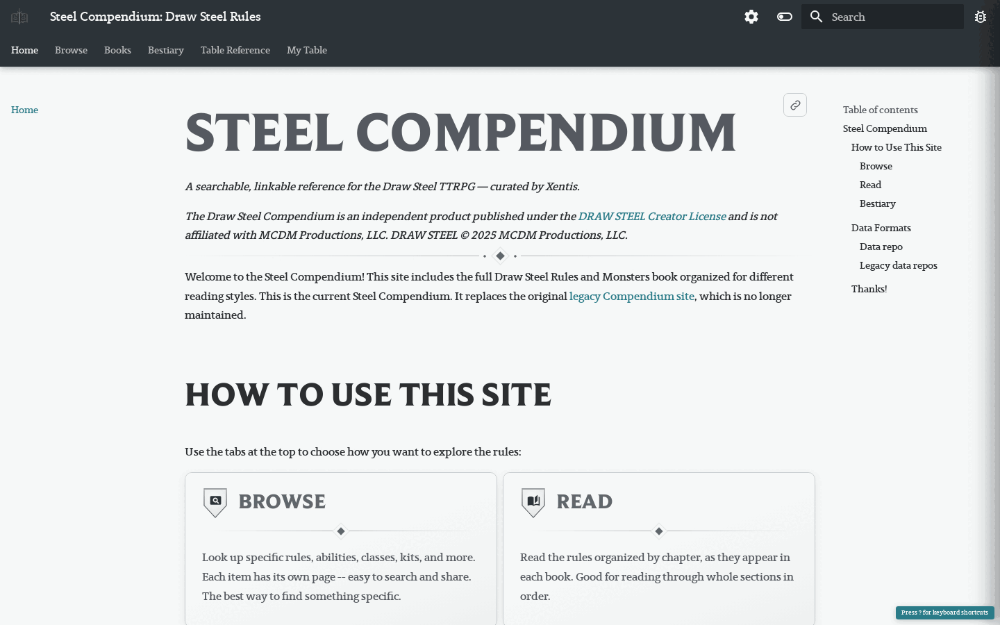
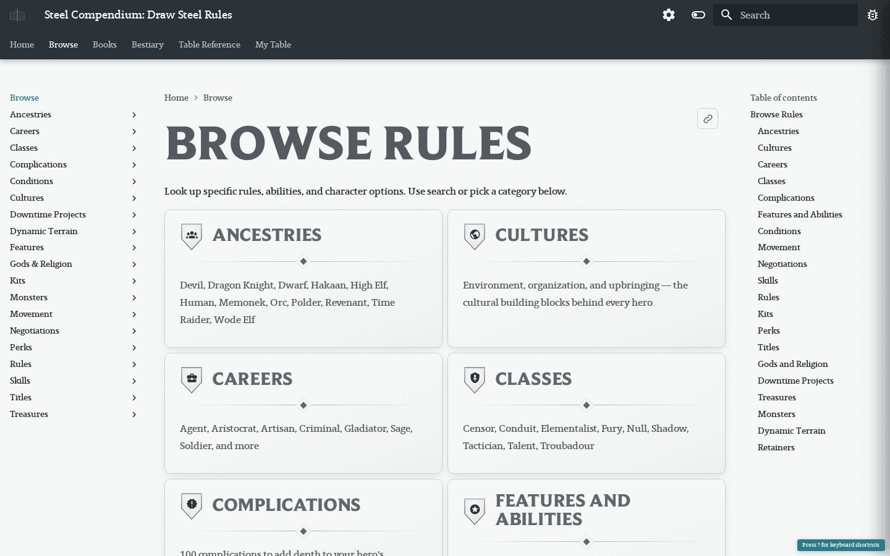
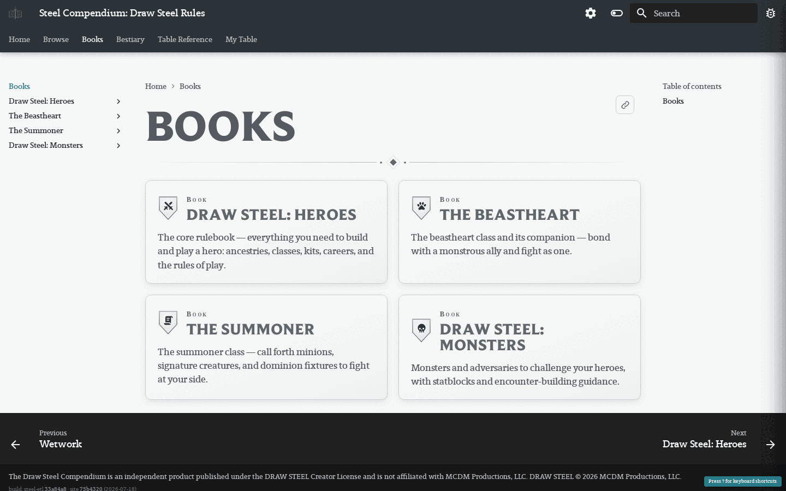
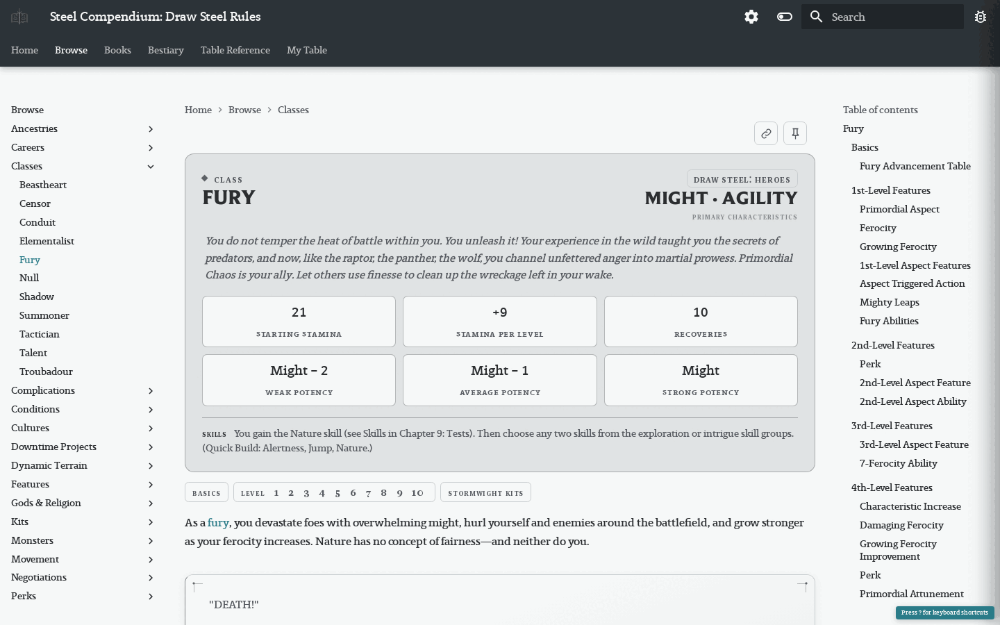
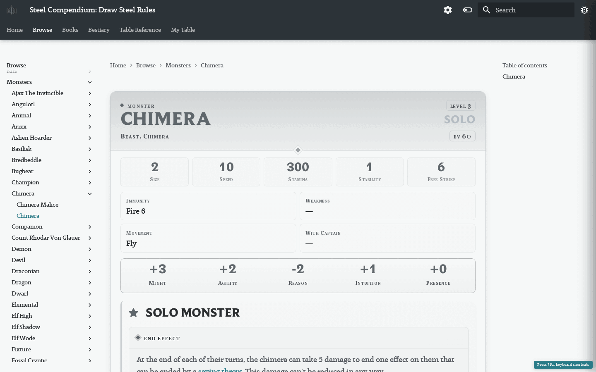
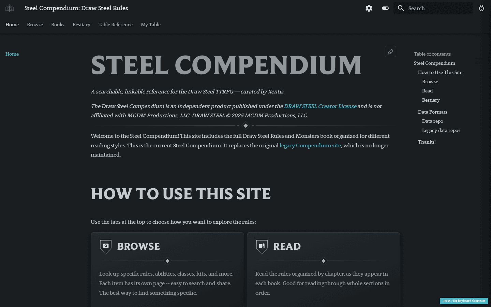

# Steel Compendium v2

Improved navigation and search for the [Steel Compendium](https://steelcompendium.io) Draw Steel rules site.

## What it looks like

|                                                                              |                                                                                    |
| ---------------------------------------------------------------------------- | ---------------------------------------------------------------------------------- |
| <br>[Home](https://steelcompendium.io/v2/) — tab overview + data-format links | <br>[Browse](https://steelcompendium.io/v2/Browse/) — rules by type |
| <br>[Read](https://steelcompendium.io/v2/Read/) — book-faithful chapters | <br>[Bestiary](https://steelcompendium.io/v2/Bestiary/) — search/filter + encounter builder |
| <br>[Class page](https://steelcompendium.io/v2/Browse/class/fury/) — Fury, with level tabs | <br>[Statblock page](https://steelcompendium.io/v2/Browse/monster/chimera/chimera/) — Chimera |

Dark mode is also supported (toggle top-right):



## Navigation tabs

- **Browse** — modular, shareable rules pages by type (classes, abilities, conditions, kits, treasures, monsters, …). Class pages open with a landing header + section jump bar; per-class ability indexes carry a sortable all-abilities table.
- **Books** — book-faithful chapters, grouped per book and ordered by source position (everything inline), with prev/next links, a collapsible "In this chapter" mini-TOC, and a resume-reading chip.
- **Bestiary** — Search & Filter over every statblock / dynamic terrain / retainer (level & EV ranges, type/role/org/size/keyword chips) plus the **encounter builder** tray (EV budget vs. the book's difficulty bands, share links, copy-as-markdown).
- **Table Reference** — a one-page GM screen: turn structure, power roll, condition one-liners, common maneuvers, movement, combat modifiers.
- **My Table** — everything pinned with the ★ control on entity pages (localStorage).
- **Search exclusion**: Read pages are excluded from search to avoid duplicate results; canonical pages carry per-type ranking boosts.

## At-the-table tools

- **Click-to-roll**: any power-roll header rolls 2d10 with edge/bane semantics and highlights the matching tier.
- **Statblock level scaler**: "Scale to level" applies the book's *Adjusting Monster Levels* formulas as deltas from the printed values (clearly banner-marked as an approximation).
- **Card exports**: hover a card for copy-permalink / ★ pin / add-to-encounter / copy-as-Markdown / download-PNG controls.

## How it's built

Content is generated by `steel-etl`, not hand-edited. `docs/Browse/`, `docs/Bestiary/`, `docs/Read/`, and `docs/scc/` are wiped and regenerated by `steel-etl site` (config: `site.yaml`). To override a generated page, place your version at the same relative path under `static_content/docs/`.

```bash
# From the workspace root — runs steel-etl gen + site + mkdocs build + push:
just deploy-v2

# Local build only (after steel-etl gen):
steel-etl site --config v2/site.yaml && mkdocs build

# Unit tests (node:test over the *-core.js modules):
node --test tests/*.test.js
```

See `CLAUDE.md` and `.repo-docs/index.md` for the full architecture.

## License

The Draw Steel Compendium is an independent product published under the DRAW STEEL Creator License and is not affiliated with MCDM Productions, LLC. DRAW STEEL (c) 2025 MCDM Productions, LLC.
